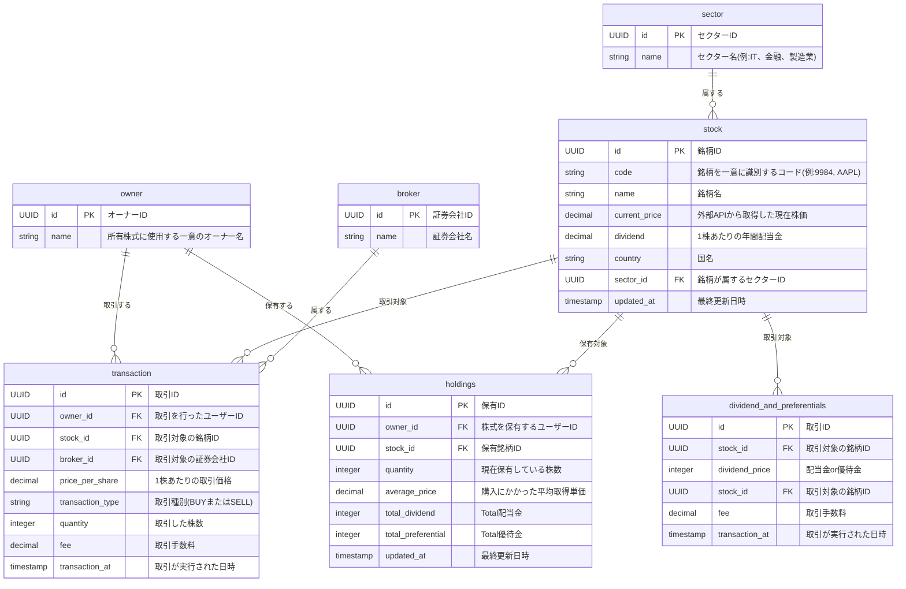

```mermaid
erDiagram
    owner {
        UUID id PK "オーナーID"
        string name "所有株式に使用する一意のオーナー名"
    }

    sector {
        UUID id PK "セクターID"
        string name "セクター名(例:IT、金融、製造業)"
    }

    broker {
        UUID id PK "証券会社ID"
        string name "証券会社名"
    }

    stock {
        UUID id PK "銘柄ID"
        string code "銘柄を一意に識別するコード(例:9984, AAPL)"
        string name "銘柄名"
        decimal current_price "外部APIから取得した現在株価"
        decimal dividend "1株あたりの年間配当金"
        string country "国名"
        UUID sector_id FK "銘柄が属するセクターID"
        timestamp updated_at "最終更新日時"
    }

    transaction {
        UUID id PK "取引ID"
        UUID owner_id FK "取引を行ったユーザーID"
        UUID stock_id FK "取引対象の銘柄ID"
        UUID broker_id FK "取引対象の証券会社ID"
        decimal price_per_share "1株あたりの取引価格"
        string transaction_type "取引種別(BUYまたはSELL)"
        integer quantity "取引した株数"
        decimal fee "取引手数料"
        timestamp transaction_at "取引が実行された日時"
    }

    dividend_and_preferentials {
        UUID id PK "取引ID"
        UUID stock_id FK "取引対象の銘柄ID"
        integer dividend_price "配当金or優待金"
        UUID stock_id FK "取引対象の銘柄ID"
        decimal fee "取引手数料"
        timestamp transaction_at "取引が実行された日時"
    }

    holdings {
        UUID id PK "保有ID"
        UUID owner_id FK "株式を保有するユーザーID"
        UUID stock_id FK "保有銘柄ID"
        integer quantity "現在保有している株数"
        decimal average_price "購入にかかった平均取得単価"
        integer total_dividend "Total配当金"
        integer total_preferential "Total優待金"
        timestamp updated_at "最終更新日時"
    }

    owner ||--o{ holdings : "保有する"
    owner ||--o{ transaction : "取引する"
    stock ||--o{ transaction : "取引対象"
    stock ||--o{ holdings : "保有対象"
    stock ||--o{ dividend_and_preferentials : "取引対象"
    sector ||--o{ stock : "属する"
    broker ||--o{ transaction : "属する"
```
